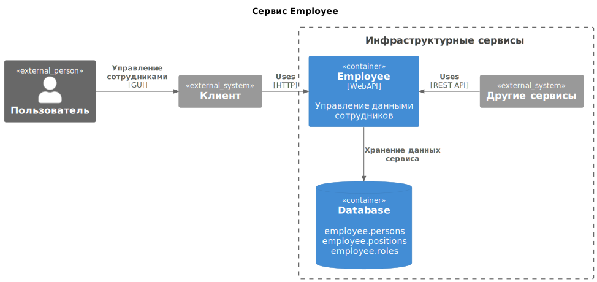
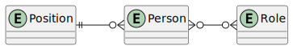

---
hide:
  - navigation
---

# Сервис Employee

!!! note "Документ в разработке"
    Вопросы к эксперту выделены {==цветом==}.

## О сервисе

Сервис Employee — это централизованный источник данных о сотрудниках организаций. Обратившись к сервису, клиент может создать, получить, обновить или удалить данные о сотруднике.

Сервис обслуживает все клиентские продукты, работающие с данными сотрудников. Если организация использует несколько таких продуктов, сервис синхронизирует данные между ними.

Данные о сотрудниках, хранимые в сервисе Employee, обычно используются в организациях для создания отчётов и стандартных операционных процедур (СОП), но также могут использоваться и внутренними сервисами для выполнения собственных задач.

## Архитектура

* **Пользователь** — лицо, управляющее данными сотрудников в рамках организации.
* **Клиент** — клиентское приложение пользователя, имеющее доступ к сервису Employee.
* **Employee** — сервис для управления данными сотрудников.
* **Database** — база данных сервиса Employee.
* **Другие сервисы** — любой внутренний сервис, которому требуется доступ к данным сотрудников.

## Сущности

Сущности сервиса Employee:

| Сущность | Описание | Таблица в БД |
| -------- | -------- | ------------ |
| Person   | Сотрудник организации. Может принадлежать к одной или более организациям. | `employee.persons`   |
| Position | Должность сотрудника. Внутри одной организации сотрудник может иметь только одну должность. | `employee.positions` |
| Role     | Роль, исполняемая сотрудником в организации. Для сотрудника в организации роль относится к одному из четырёх типов (см. ниже: [Типы ролей](#_4)). Роль одного сотрудника в двух разных организациях может отличаться. | `employee.roles` |

Создаваемые пользователем сущности привязываются к пользователю и являются общими для всех организаций пользователя.

Отношения сущностей сервиса Employee внутри организации:

### Типы ролей

В сервисе Employee любая создаваемая роль относится к одному из четырёх типов ролей:

* Руководитель.
* Главный бухгалтер.
* Уполномоченный представитель (отправитель).
* Индивидуальный предприниматель.

## API клиента

Для обработки клиентских запросов в сервисе Employee используются эндпоинты:

| Эндпоинт    | Назначение              |
| ----------- | ----------------------- |
| `/person`   | Операции с сотрудником  |
| `/persons`  | Операции с сотрудниками |
| `/position` | Операции с должностью   |
| `/role`     | Операции с ролью        |
| `/roles`    | Операции с ролями       |

---
### **POST** `/person`

Создать сотрудника.

!!! warning "DEPRECATED"
    Для создания сотрудника используйте метод **PUT** `/person/{PersonId}` — новый метод позволит избежать возможной проблемы дублирования данных при заведении одного и того же сотрудника в разных организациях.

...

---
### **PUT** `/person/{PersonId}`

Сохранить сотрудника.

Метод для создания нового сотрудника.

{==Для обновления данных сотрудника используется этот же метод?==}

#### Параметры запроса

##### Path parameters

| Параметр     | Обязательность | Описание                                                       |
| ------------ | -------------- | -------------------------------------------------------------- |
| `{PersonId}` | Да             | Идентификатор пользователя, сгенерированный на клиенте (GUID). |

##### Body parameters

| Параметр              | Тип                                         | Обязательность  | Описание                     |
| --------------------- | -----------    ---------------------------- | --------------- | ---------------------------- |
| `fullName`            | [FullName](#fullname)                       | Да              | ФИО                          |
| `innFl`               | String                                      | Нет             | ИНН                          |
| `gender`              | Enum                                        | Нет             | Пол. Enum: {==Значения==} |
| `citizenship`         | String                                      | Нет             | Гражданство                  |
| `birthDate`           | DateTime                                    | Нет             | Дата рождения                |
| `birthPlace`          | String                                      | Нет             | Место рождения               |
| `phone`               | String                                      | Нет             | Номер телефона               |
| `email`               | String                                      | Нет             | Адрес электронной почты      |
| `registrationAddress` | [RegistrationAddress](#registrationaddress) | Нет             | Адрес регистрации            |
| `identityCard`        | [IdentityCard](#identitycard)               | Нет             | Данные паспорта              |
| `foreignAddress`      | String                                      | Нет             | {==Описание==}               |

###### FullName

Объект содержит полное имя сотрудника.

{==Описания параметров==}

###### RegistrationAddress

Объект содержит сведения о регистрации.

{==Описания параметров==}

###### IdentityCard

Объект содержит данные паспорта.

| Параметр       | Тип      | Обязательность  | Описание          |
| -------------- | -------- | --------------- | ----------------- |
| `documentType` | String   | Нет             | Тип документа     |
| `series`       | String   | Нет             | Серия             |
| `number`       | String   | Нет             | Номер             |
| `issuer`       | String   | Нет             | Кем выдан         |
| `issuanceDate` | DateTime | Нет             | Дата выдачи       |
| `issuerCode`   | String   | Нет             | Код подразделения |

#### Параметры ответа

{==HTTP-коды и параметры ответа==}

---
### **GET** `/person/{personId}`

Получить данные сотрудника.

...

---
### **GET** `/person/{PersonId}/roles`

Получить список ролей сотрудника.

...

---
### **DELETE** `/person/{PersonId}`

Удалить сотрудника.

...

---
### **GET** `/persons`

Получить список сотрудников, созданных пользователем.

#### Параметры запроса

Нет.

#### Параметры ответа

| Параметр     | Тип                    | Описание                             |
| ------------ | ---------------------- | ------------------------------------ |
| `persons`    | Arr[[Person](#person)] | Список сотрудников (массив объектов) |
| `totalCount` | Integer                | Количество сотрудников               |

##### Person

Объект содержит данные сотрудника.

| Параметр              | Тип                                         | Обязательность  | Описание                     |
| --------------------- | ------------------------------------------- | --------------- | ---------------------------- |
| `guid`                | [Guid](#guid)                               | Да              | Идентификатор пользователя   |
| `fullName`            | [FullName](#fullname)                       | Да              | ФИО                          |
| `innFl`               | String                                      | Нет             | ИНН                          |
| `gender`              | Enum                                        | Нет             | Пол. Enum: {==Значения==} |
| `citizenship`         | String                                      | Нет             | Гражданство                  |
| `birthDate`           | DateTime                                    | Нет             | Дата рождения                |
| `birthPlace`          | String                                      | Нет             | Место рождения               |
| `phone`               | String                                      | Нет             | Номер телефона               |
| `email`               | String                                      | Нет             | Адрес электронной почты      |
| `registrationAddress` | [RegistrationAddress](#registrationaddress) | Нет             | Адрес регистрации            |
| `identityCard`        | [IdentityCard](#identitycard)               | Нет             | Данные паспорта              |
| `foreignAddress`      | String                                      | Нет             | {==Описание==}               |

##### Guid

{==Описание==}

---

### **PUT** `/position`

Создать должность.

Внутри организации сотруднику можно присвоить должность. Для этого наименованию должности нужно сопоставить идентификаторы сотрудника и организации.

#### Параметры запроса

##### Body parameters

| Параметр       | Тип           | Обязательность | Описание                  |
| -------------- | ------------- | -------------- | ------------------------- |
| `person`       | [Guid](#guid) | Да             | Идентификатор сотрудника  |
| `organization` | [Guid](#guid) | Да             | Идентификатор организации |
| `title`        | String        | Нет            | Наименование должности    |

#### Параметры ответа

{==HTTP-коды и параметры ответа==}

---
### **DELETE** `/position`

Удалить должность.

...

---
### **PUT** `/role`

Назначить роль.

Любому сотруднику с назначенной должностью можно назначить роль, которая будет действовать в этой же организации, или в другой, где сотруднику требуется исполнять эту роль.

#### Параметры запроса

##### Body parameters

| Параметр               | Тип    | Обязательность | Описание |
| ---------------------- | ------ | -------------- | -------- |
| `person`               | [Guid](#guid) | Да | Идентификатор сотрудника |
| `positionOrganization` | [Guid](#guid) | Да | Идентификатор организации, в которой сотрудник занимает должность |
| `organization`         | [Guid](#guid) | Да | Идентификатор организации, в которой сотруднику выделяется роль |
| `type`                 | Enum          | Да | Тип роли. Enum:  `1` руководитель `2` главный бухгалтер `3` уполномоченный представитель (отправитель) `4` индивидуальный предприниматель |

#### Параметры ответа

##### HTTP: 200 OK

{==200 или 201==}

Ответ содержит данные о сотруднике и должности, которым в организации был назначен запрашиваемый тип роли.

| Параметр   | Тип                   | Обязательность | Описание                 |
| ---------- | --------------------- | -------------- | ------------------------ |
| `person`   | [Person](#person)     | Да             | Сотрудник                |
| `position` | [Position](#position) | Да             | Должность в организации  |

###### Position

Объект содержит сведения о должности сотрудника в организации.

| Параметр       | Тип           | Обязательность | Описание                  |
| -------------- | ------------- | -------------- | ------------------------- |
| `person`       | [Guid](#guid) | Да             | Идентификатор сотрудника  |
| `organization` | [Guid](#guid) | Да             | Идентификатор организации |
| `title`        | String        | Нет            | Наименование должности    |

---
### **DELETE** `/role`

Удалить роль.

...

---
### **GET** `/roles`

Получить список ролей.

...

---
### **DELETE** `/roles`

Удалить все роли.

...

---
